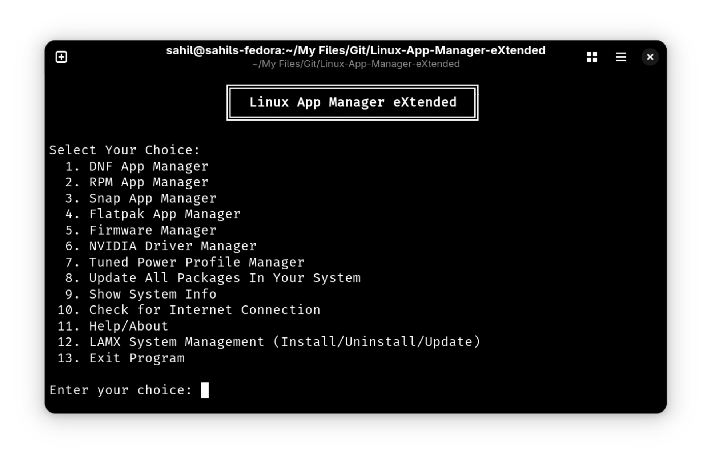

# Linux App Manager eXtended (LAMX)

<div align="center">
  
</div>

LAMX is a powerful, interactive Bash script that helps you manage Linux applications and system tools from a single, unified menu. It supports all major package managers (APT, Pacman, DNF, DEB, RPM, Snap, Flatpak), firmware updates, NVIDIA drivers, and power profiles. LAMX is designed for users who want a central, easy-to-use app management experience on any Linux distribution.

## Getting Started

1. **First Run**
   - Download or clone the repository.
   - Open a terminal in the `Linux-App-Manager-eXtended` folder.
   - Run the script:
     ```sh
     ./lamx
     ```
   - If you get a permission error, make the script executable:
     ```sh
     chmod +x lamx
     ./lamx
     ```

2. **LAMX Setup**
   - To install LAMX systemwide, launch the script and select option `15` from the main menu:  
     `LAMX System Management (Install/Uninstall/Update)`
   - Follow the prompts to install, uninstall, or update LAMX.
   - Note: You can only use the uninstall and update options after installing LAMX systemwide.
   - After installing systemwide, you can simply type `lamx` in any terminal to start the app.

## Main Features

- Dynamic menu: only shows options for package managers and system tools detected on your system.
- Manage apps using APT, Pacman, DNF, DEB, RPM, Snap, and Flatpak.
- Update all packages across supported managers with one command.
- Manage firmware updates and NVIDIA drivers.
- Configure power profiles with Tuned.
- Edit package manager configuration and repository files.

## Usage

- Start LAMX with `./lamx`.
- Type the number of the menu option you want and press Enter.
- For installing, uninstalling, or updating LAMX itself, use the LAMX System Management option in the main menu.
- You can only use the uninstall and update options after installing LAMX systemwide.
- After installing systemwide, you can simply type `lamx` in any terminal to start the app.
- For help or more information, use the Help/About option in the menu.

## Notes

- LAMX checks which package managers are available on your system and only shows relevant options.
- For uninstalling or cleaning up, you’ll see a preview and be asked to confirm before any changes are made.
- You need root privileges for using this tool.

## Support

If you encounter issues or have suggestions, please open an issue on the repository.
