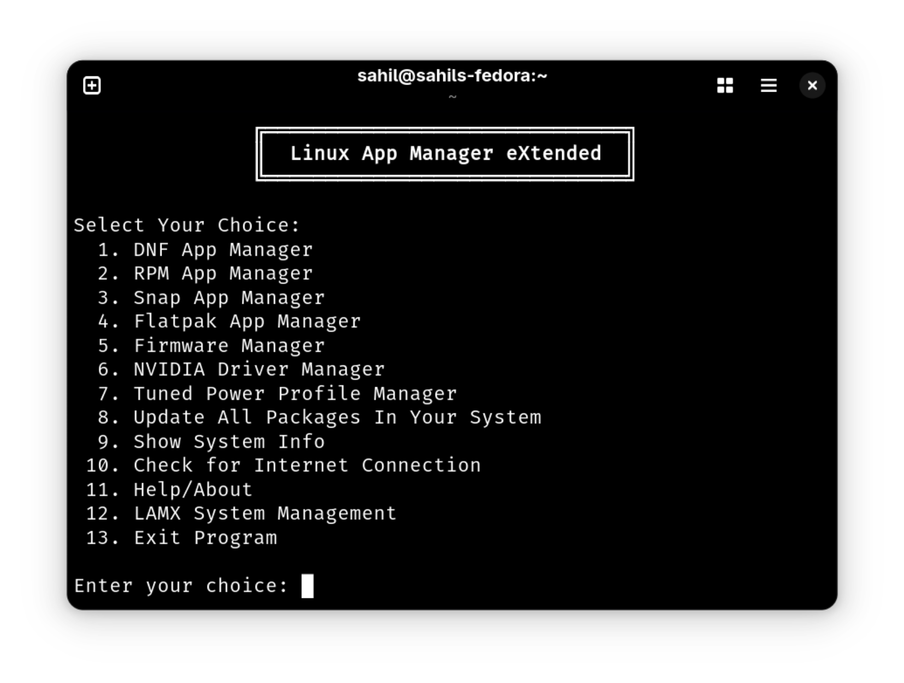

# Linux App Manager eXtended (LAMX)

<div align="center">
  
</div>

LAMX is a powerful, interactive Bash script that helps you manage Linux applications and system tools from a single, unified menu. It supports all major package managers (APT, Pacman, DNF, DEB, RPM, Snap, Flatpak), firmware updates, NVIDIA drivers, and power profiles. LAMX is designed for users who want a central, easy-to-use app management experience on any Linux distribution.

## Getting Started

1. **First Run**
   - Download or clone the repository.
   - Open a terminal in the `Linux-App-Manager-eXtended` folder.
   - Run the script:
     ```sh
     ./lamx
     ```
   - If you get a permission error, make the script executable:
     ```sh
     chmod +x lamx
     ./lamx
     ```

2. **LAMX Setup**
   - To install LAMX systemwide, launch the script and select option `15` from the main menu:  
     `LAMX System Management`
   - Follow the prompts to install, uninstall, or update LAMX.
   - After installing systemwide, you can simply type `lamx` in any terminal to start the app.

## Main Features
- Manage apps using APT, Pacman, DNF, DEB, RPM, Snap, and Flatpak.
- Update all packages across supported managers with one command.
- Manage firmware updates and NVIDIA drivers.
- Configure power profiles with Tuned.
- Edit package manager configuration and repository files.

## Usage

- Start LAMX with `./lamx`.
- Type the number of the menu option you want and press Enter.
- For installing, uninstalling, or updating LAMX itself, use the LAMX System Management option in the main menu.
- After installing systemwide, you can simply type `lamx` in any terminal to start the app.
- For help or more information, use the Help/About option in the menu.

## Menu Option Types

- **Persistent (Always Available) Options:**
  - Snap App Manager
  - Flatpak App Manager
  - NVIDIA Driver Manager
  - Tuned Power Profile Manager
  - Update All Packages In Your System
  - Show System Info
  - Check for Internet Connection
  - Help/About

- **Dynamic Options (Only if detected on your system):**
  - APT App Manager
  - Pacman App Manager
  - DNF App Manager
  - DEB App Manager
  - RPM App Manager
  - Firmware Manager

## Persistent Menu Customization

You can show/hide any main menu option (except Exit and LAMX System Management) using the "Manage Main Menu Options" feature in LAMX System Management. Your choices are saved and persist across sessions in `~/.config/lamx/menu.conf`.

**How to Manage Menu Options:**

1. Go to LAMX System Management from the main menu.
2. Select "Manage Main Menu Options".
3. Toggle visibility for any option. Hidden options are shown in red, visible in green.
4. Changes take effect immediately and are saved for future runs.

## Notes

- LAMX checks which package managers are available on your system and only shows relevant options.
- For uninstalling or cleaning up, you’ll see a preview and be asked to confirm before any changes are made.
- You need root privileges for using this tool.

## Support

If you encounter issues or have suggestions, please open an issue on the repository.
